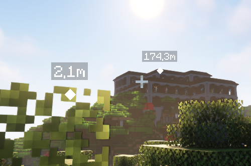
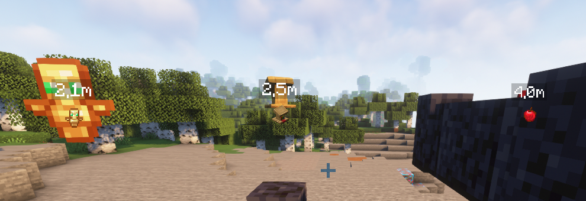

  

<h3 align="center">Ping Wheel</h3>

    ease communication with your friends by pinging locations

## About

Modern co-op games often allow players to communicate via "pings" to mark in-game locations.  
This simple mod provides such pinging mechanism for the fabric and forge mod loaders.

Default Keybind is "Mouse5" aka "Forward" to ping.  
The Settings can also be opened from the Mod Menu integration.

If you are looking to use the mod on Bukkit servers, you can install our [official Plugin](https://github.com/RXJpaw/Minecraft-Ping-Wheel-Plugin/).

## Gallery

The following screenshot shows two pings in different distances with according scale.

When enabled, this feature replaces the ping icon with the respective item texture (or model).

## Dependencies

  

